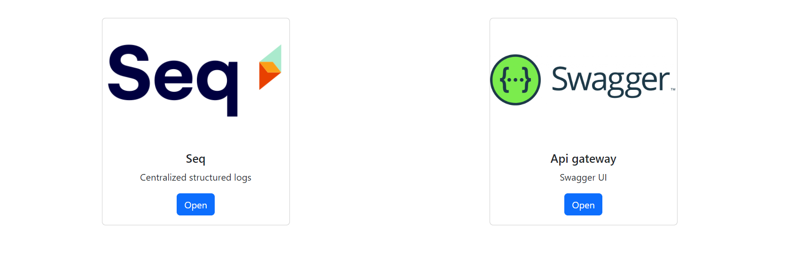
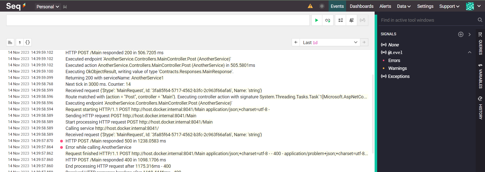
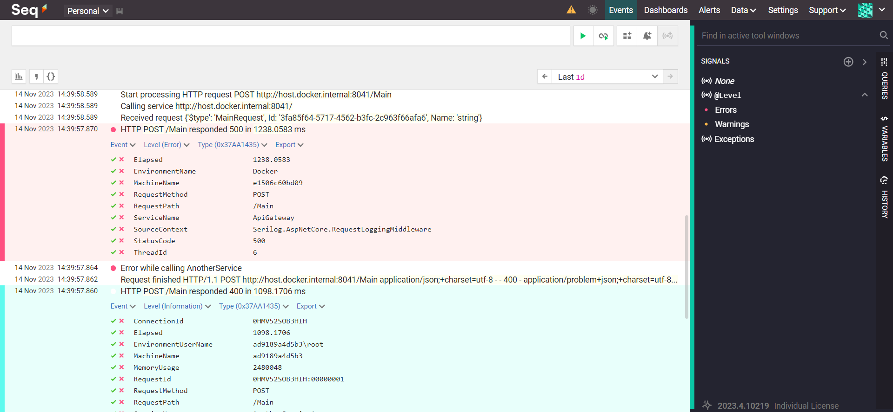
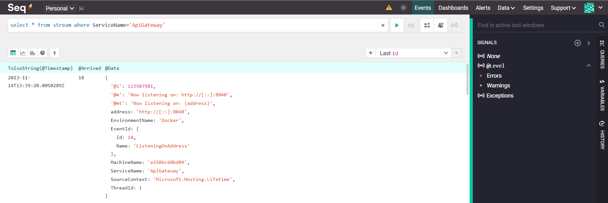
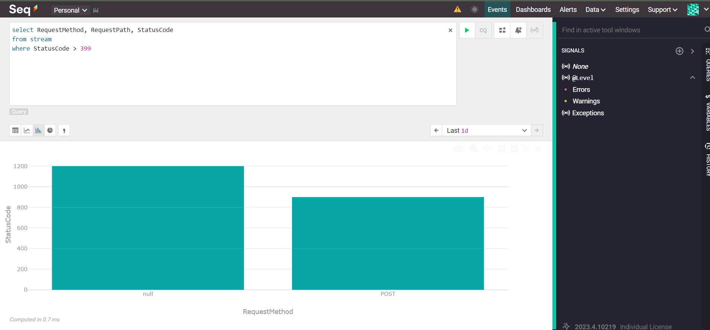

# :bookmark_tabs:Problem Description

When logs from different services are scattered across files in various folders, managing and analyzing them becomes a challenging task. This fragmented log storage can lead to several issues:

1. **Difficulty in Centralized Analysis:** Analyzing logs spread across different locations is time-consuming and inefficient.

2. **Lack of Real-time Monitoring:** Real-time monitoring of logs becomes cumbersome when they are not centralized.

3. **Inconsistent Log Formats:** Different services may use different log formats, making it challenging to derive meaningful insights.

4. **Limited Search and Filter Capabilities:** Locating specific logs or filtering based on criteria becomes a manual and error-prone process.

## :speech_balloon: Solution Serilog .NET and Seq

Serilog is a powerful logging library for .NET applications, and Seq is a centralized log server with a user-friendly UI. Combining these tools can provide an effective solution to the mentioned problems.

**1. Install Serilog and Seq Packages**
Add the necessary NuGet packages to your .NET project:

```console
dotnet add package Serilog
dotnet add package Serilog.Sinks.Seq
```

**2. Configure Serilog in your Application**
Configure Serilog to write logs and send them to Seq. This can be done in your application's startup code:

```c#
using Serilog;

Log.Logger = new LoggerConfiguration()
    .WriteTo.Console()  // Optional: Output logs to console
    .WriteTo.Seq("http://your-seq-server-url")  // Replace with your Seq server URL
    .CreateLogger();
```

**3. Use Serilog for Logging in Your Application**
Replace your existing logging code with Serilog. For example:

```c#
Log.Information("This is an informational message");
Log.Error("An error occurred: {errorMessage}", ex.Message);
```

**4. Run and Monitor Seq**
Start your application, and the logs will be sent to Seq in real-time. Visit the Seq UI (usually <http://your-seq-server-url>) to explore, analyze, and search your logs easily.
Links:

* <https://serilog.net/>

* <https://datalust.co/seq>

* <https://docs.datalust.co/docs/sql-queries>

## 🚀 How to

* Ensure you have `Docker` installed and running.
* Ensure you have `docker-compose` installed.
* Go to scripts folder and run ``build-all.bat``
* Run ``up.bat``
* As soon as `docker-compose` starts open ``html/index.html``



### :framed_picture: Screenshots









## :partying_face: **Benefits:**

**Centralized Logging:** All logs from different services are now centralized in Seq.

**Real-time Monitoring:** Seq provides real-time monitoring, allowing you to react promptly to issues.

**Consistent Log Formats:** Serilog allows you to define a consistent log format across services.

**Powerful Search and Filter:** Seq's UI offers powerful search and filter capabilities, making log analysis efficient.

By following these steps, you can streamline your log management process and gain better insights into the behavior of your distributed applications.
