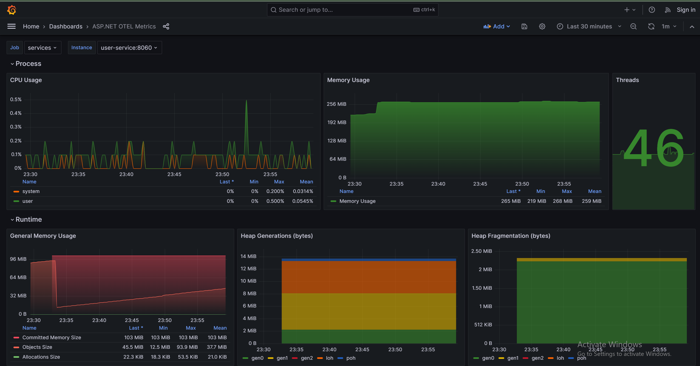

#**Telemetry .NET**

This is sample project to show and understand how Telemetry working in .NET with logging, tracing and metrics. We will use OpenTelemetry. 

>OpenTelemetry, also known as OTel for short, is a vendor-neutral open source Observability framework for instrumenting, generating, collecting, and exporting telemetry data such as traces, metrics, logs. As an industry-standard, it is supported by 40+ observability vendors, integrated by many libraries, services and apps and adopted by a number of end-users.

Links:
* https://opentelemetry.io/
* https://opentelemetry.io/docs/

.NET applications with OpenTelemetry:
* https://opentelemetry.io/docs/instrumentation/net/getting-started/
* https://github.com/open-telemetry/opentelemetry-dotnet
* https://www.nuget.org/packages/OpenTelemetry/

## :desktop_computer: Services
1) ApiGateway - main entry point
2) Validation service - for validate entities
3) Order service - for managing orders and store them
4) User service - for managing users and store them

## 📊 Components diagram

Services for OpenTelemetry:
1) Prometheus - save metrics
2) Loki - log storage 
3) Jaeger - tracing
4) Grafana - visualize
5) Otel-collector - collector for logs/metrics/tracing
6) MongoDb - database for entities
7) RabbitMQ - for async communication

## 🚀 How to run locally
* Ensure you have `Docker` installed and running.
* Ensure you have `docker-compose` installed.
* Go to scripts folder and run ``build-all.bat``
* Run ``up.bat``
* As soon as `docker-compose` starts open ``html/index.html``

### :chart_with_upwards_trend: Grafana

>Grafana open source is open source visualization and analytics software. It allows you to query, visualize, alert on, and explore your metrics, logs, and traces no matter where they are stored. It provides you with tools to turn your time-series database (TSDB) data into insightful graphs and visualizations.

Grafana has 3 dashboards:

* Logs dashboard, you can observe all logs from all of your services

* .NET ASP Core metrics dashboard

* Custom metrics dashboard:
  1) Show total calls for specific service
  2) Show custom metric ``total orders``
  3) Show custom metric ``total users``
  4) Show custom metric ``total order item quantity``

### :chart_with_downwards_trend: Jaeger

>Jaeger represents tracing data in a data model inspired by the OpenTracing Specification  . The data model is logically very similar to OpenTelemetry Traces  , with some naming differences:

* Tracing of request from ApiGateway through all components

