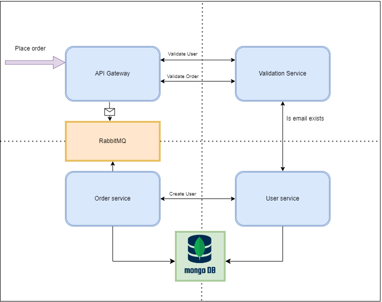
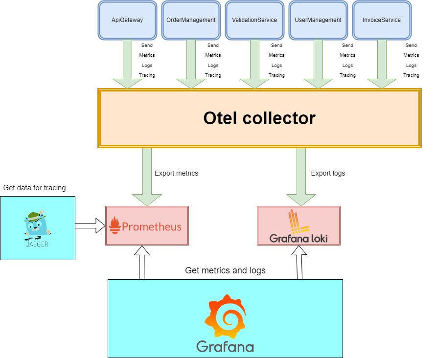

# :bookmark_tabs:**Telemetry .NET**

This project serves as a demonstrative guide to comprehend the intricacies of telemetry in .NET, focusing on logging, tracing, and metrics. The implementation will leverage OpenTelemetry, a powerful observability framework that facilitates the collection of telemetry data from your applications.

## What is Telemetry?

Telemetry involves the automated collection and transmission of data regarding the performance, usage, and health of an application. In the context of software development, telemetry provides insights into how an application behaves in various scenarios, aiding developers in identifying issues, optimizing performance, and making informed decisions.

## Why Telemetry?

Telemetry plays a crucial role in understanding the runtime characteristics of applications. It provides answers to questions such as:

* How is the application performing?
* What are the critical paths and bottlenecks?
* Are there any errors or exceptions occurring?
* What is the user experience like?

Links:

* <https://opentelemetry.io/>
* <https://opentelemetry.io/docs/>

.NET applications with OpenTelemetry:

* <https://opentelemetry.io/docs/instrumentation/net/getting-started/>
* <https://github.com/open-telemetry/opentelemetry-dotnet>
* <https://www.nuget.org/packages/OpenTelemetry/>

## :desktop_computer: Services

1) ApiGateway - main entry point
2) Validation service - for validate entities
3) Order service - for managing orders and store them
4) User service - for managing users and store them

### 📊 Components diagram

Services for OpenTelemetry:

1) Prometheus - storage for metrics
2) Loki - log storage
3) Jaeger - tracing UI
4) Grafana - metric/logs UI
5) Otel-collector - collector for logs/metrics/tracing
6) MongoDb - database for entities
7) RabbitMQ - for async communication

Open telemetry flow diagram:

## 🚀 How to

* Ensure you have `Docker` installed and running.
* Ensure you have `docker-compose` installed.
* Go to scripts folder and run ``build-all.bat``
* Run ``up.bat``
* As soon as `docker-compose` starts open ``html/index.html``

### :chart_with_upwards_trend: Grafana

>Grafana open source is open source visualization and analytics software. It allows you to query, visualize, alert on, and explore your metrics, logs, and traces no matter where they are stored. It provides you with tools to turn your time-series database (TSDB) data into insightful graphs and visualizations.

Grafana has 3 dashboards:

* Logs dashboard, you can observe all logs from all of your services

* .NET ASP Core metrics dashboard

* Custom metrics dashboard:
  1) Show pie chart ``users per country``
  2) Show pie chart ``users per age``
  3) Show custom metric ``total orders``
  4) Show custom metric ``total users``
  5) Show custom metric ``total order item quantity``
  6) Show order item quantity distribution
  7) Show order price distribution
  8) Show totat price graph

### :chart_with_downwards_trend: Jaeger

>Jaeger represents tracing data in a data model inspired by the OpenTracing Specification  . The data model is logically very similar to OpenTelemetry Traces  , with some naming differences:

* Tracing of request from ApiGateway through all components

### :chart_with_downwards_trend: Prometheus

* Active targets

* Queries

## Conclusion

By embracing OpenTelemetry in your .NET applications, you empower yourself with a comprehensive telemetry solution. This allows you to gain valuable insights into your application's behavior, facilitating informed decision-making, efficient debugging, and performance optimization. OpenTelemetry's versatility in logging, tracing, and metrics makes it an invaluable tool for any developer striving for a deeper understanding of their software's runtime characteristics.